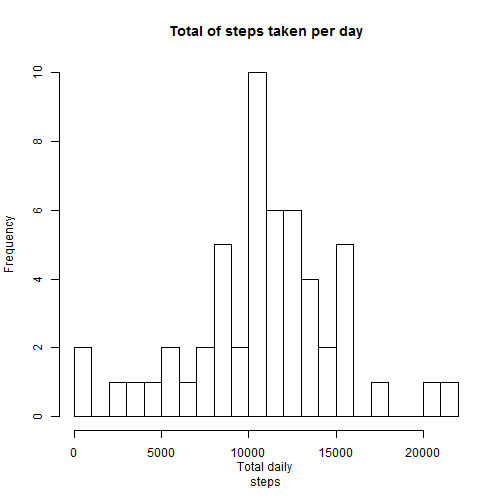
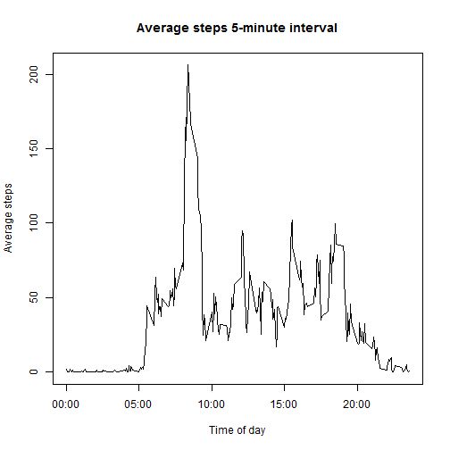
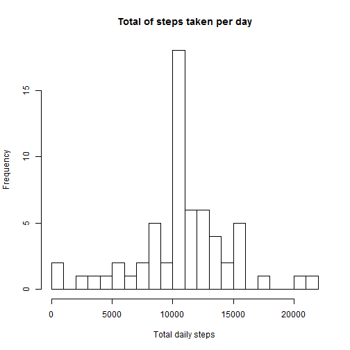
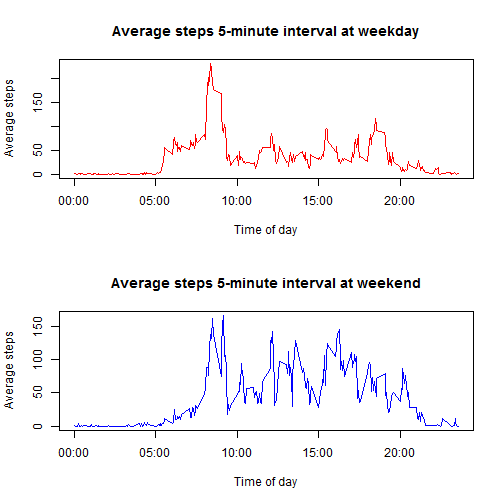
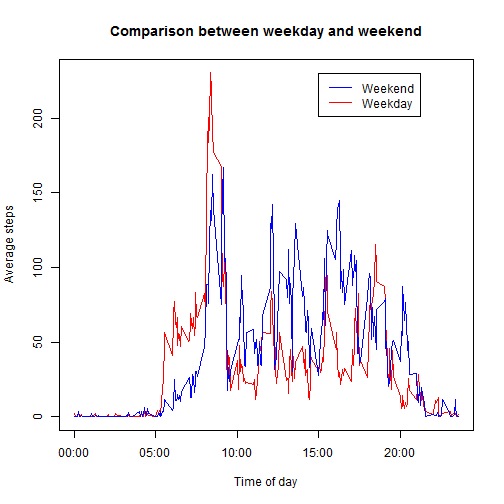

## Reproducible Research: Peer Assessment 1


```r
## Loading and preprocessing the data

setwd("C:/Users/Vidya/Desktop/R/RepResearch")
data <- read.csv("activity.csv")

hist(tapply(data$steps, data$date, sum), xlab = "Total daily 
steps", breaks = 20, 
    main = "Total of steps taken per day")
```

 

```r
total.daily.steps <- as.numeric(tapply(data$steps, data$date, 
sum))
step.mean <- mean(total.daily.steps, na.rm = TRUE)
step.median <- median(total.daily.steps, na.rm = TRUE)

step.mean
```

```
## [1] 10766
```

```r
step.median
```

```
## [1] 10765
```

```r
## Average daily activity pattern

data$interval <- as.factor(as.character(data$interval))
interval.mean <- as.numeric(tapply(data$steps, data$interval, 
mean, na.rm = TRUE))
intervals <- data.frame(intervals = as.numeric(levels(data
$interval)), interval.mean)
intervals <- intervals[order(intervals$intervals), ]

labels <- c("00:00", "05:00", "10:00", "15:00", "20:00")
labels.at <- seq(0, 2000, 500)
plot(intervals$intervals, intervals$interval.mean, type = "l", 
main = "Average steps 5-minute interval", 
    ylab = "Average steps", xlab = "Time of day", xaxt = "n")
axis(side = 1, at = labels.at, labels = labels)
```

 

```r
intervals.sorted <- intervals[order(intervals$interval.mean, 
decreasing = TRUE), 
    ]
head(intervals.sorted)
```

```
##     intervals interval.mean
## 272       835         206.2
## 273       840         195.9
## 275       850         183.4
## 274       845         179.6
## 271       830         177.3
## 269       820         171.2
```

```r
max.interval <- intervals.sorted$intervals[1[1]]
max.interval
```

```
## [1] 835
```

```r
##Input missing values
dim(data[is.na(data$steps), ])[1]
```

```
## [1] 2304
```

```r
## Total # of Steps taken per day

steps <- vector()
for (i in 1:dim(data)[1]) {
    if (is.na(data$steps[i])) {
        steps <- c(steps, intervals$interval.mean[intervals
$intervals == data$interval[i]])
    } else {
        steps <- c(steps, data$steps[i])
    }
}


activity.without.missing.data <- data.frame(steps = steps, date 
= data$date, 
    interval = data$interval)

hist(tapply(activity.without.missing.data$steps, 
activity.without.missing.data$date, 
    sum), xlab = "Total daily steps", breaks = 20, main = 
"Total of steps taken per day")
```

 

```r
total.daily.steps <- as.numeric(tapply
(activity.without.missing.data$steps, 
    activity.without.missing.data$date, sum))
step.mean <- mean(total.daily.steps)
step.median <- median(total.daily.steps)
step.mean
```

```
## [1] 10766
```

```r
step.median
```

```
## [1] 10766
```

```r
##Are there differences in activity patterns between weekdays and weekends?

activity.without.missing.data$day.type <- c("weekend", "weekday", "weekday",     "weekday", "weekday", "weekday", "weekend")[as.POSIXlt(activity.without.missing.data$date)$wday + 1]
activity.without.missing.data$day.type <- as.factor(activity.without.missing.data$day.type)

weekday <- activity.without.missing.data[activity.without.missing.data$day.type ==     "weekday", ]
weekend <- activity.without.missing.data[activity.without.missing.data$day.type ==     "weekend", ]
weekday.means <- as.numeric(tapply(weekday$steps, weekday$interval, mean))
weekend.means <- as.numeric(tapply(weekend$steps, weekend$interval, mean))

intervals.day.type <- data.frame(intervals = as.numeric(levels (data$interval)), weekday.means, weekend.means)
intervals.day.type <- intervals.day.type[order (intervals.day.type$intervals), ]

## Plot two time series

par <- par(mfrow = c(2, 1))
plot(intervals.day.type$intervals, intervals.day.type
$weekday.means, type = "l", 
    col = "red", ylab = "Average steps", xlab = "Time of day", 
main = "Average steps 5-minute interval at weekday", 
    xaxt = "n")
axis(side = 1, at = labels.at, labels = labels)
plot(intervals.day.type$intervals, intervals.day.type
$weekend.means, type = "l", 
    col = "blue", ylab = "Average steps", xlab = "Time of day", 
main = "Average steps 5-minute interval at weekend", 
    xaxt = "n")
axis(side = 1, at = labels.at, labels = labels)
```

 

```r
par(par)
## Comparison

plot(intervals.day.type$intervals, intervals.day.type
$weekday.means, type = "l", 
    col = "red", ylab = "Average steps", xlab = "Time of day", 
main = "Comparison between weekday and weekend", 
    xaxt = "n")
axis(side = 1, at = labels.at, labels = labels)
lines(intervals.day.type$intervals, intervals.day.type
$weekend.means, type = "l", 
    col = "blue")
legend(1500, 230, c("Weekend", "Weekday "), lty = c(1, 1), lwd 
= c(1, 1), col = c("blue", 
    "red"))
```

 


